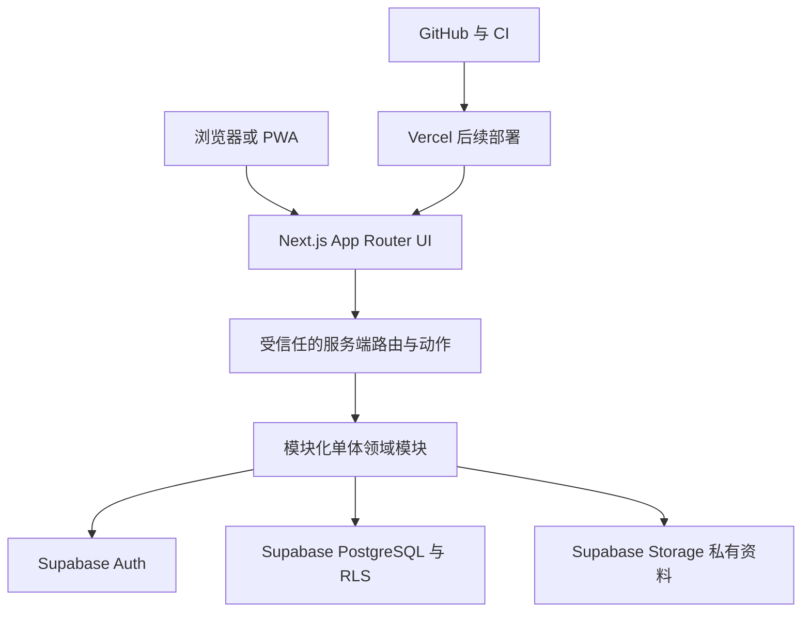

# 技术架构与核心数据模型

文档状态：G1/旧架构技术规划历史快照；应用当前未连接 Supabase 或部署；当前资源管理面事实见[G2-A1 资源预检证据](./evidence/G2-A1/2026-08-28-entry-preparation/README.md)
适用范围：后续真实实现的架构、模块、数据隔离和安全边界  
证据边界：本文只提供后续实现的规划合同；本地视觉原型不实现数据库、认证、后端或 Storage，本文不据此推断外部环境是否存在。

## 1. 推荐架构与选择理由

推荐采用面向中文/意大利语/英语的 Next.js App Router + TypeScript 响应式网站/PWA，使用模块化单体承载受信任服务端逻辑，Supabase 提供欧盟区域的 PostgreSQL、Auth 和 Storage，RLS 负责数据库最终隔离，Vercel 负责后续部署，Tailwind CSS + shadcn/ui 作为界面基础，GitHub/CI 负责版本和检查。具体技术版本、欧盟区域项目、密钥和生产配置当前未锁定；实施时必须复核 Next.js、Supabase、Vercel、Tailwind CSS、shadcn/ui 及相关依赖的官方文档。

选择模块化单体的原因：

- V1 的身份、组织、商品、价格、库存、购物车、订单和售后有强事务关系，单一部署单元更容易保持一致性。
- 团队规模和 V1 范围不需要一开始承担微服务的网络、部署、观测和数据一致性成本。
- 领域模块和 API 边界可以先在单体内隔离；当真实负载或组织边界需要时，再按证据拆分。
- 认证、RLS、幂等、审计和订单流程可以集中形成可审查的信任边界。

## 2. 分层图



数据和请求边界：

```text
浏览器输入
  -> UI 展示层
  -> 服务端认证、授权、DTO 校验
  -> 领域服务与事务
  -> PostgreSQL/RLS 或私有 Storage
  -> 脱敏后的响应 DTO
```

浏览器不能携带或调用 service role，不能直接写入高风险业务表。所有版本、区域、密钥和环境值必须在真实实现前由 Owner 和专项审查确认。

## 3. 模块边界与 API 边界

| 模块 | 负责 | 概念 API 边界 |
|---|---|---|
| 身份与权限 | 会话、用户、成员、角色、批发资格和授权上下文 | auth、memberships、entitlements |
| 组织与店铺 | 商家申请、组织、店铺、成员范围和状态 | platform/organizations、merchant/stores |
| 分类与目录 | 分类树、商品、变体和 listing | catalog/categories、catalog/products |
| 价格 | 零售/批发价格、起订量、阶梯价和适用价格计算 | catalog/prices、pricing/quote |
| 库存 | 数量库存、单件库存、预留和变动记录 | inventory/availability、inventory/movements |
| 客户与地址 | 客户最小资料、地址和批发申请 | customers/profile、customers/addresses、wholesale/applications |
| 购物车与结算 | 购物车分组、结算校验、批次创建和幂等 | carts、checkout/validate、checkout/submit |
| 订单与事件 | 商家子订单、商品项、状态事件和查询 | orders/batches、orders/merchant-orders、orders/events |
| 售后 | 售后申请、证据、状态和处理记录 | after-sales |
| 审计 | 安全相关动作、对象、请求标识和前后状态 | audit/internal；不对普通买家开放 |

API 只是规划边界，不是已创建的路由。UI 只能调用与当前用户、组织、店铺和状态匹配的服务端用例；服务端不能信任浏览器传入的组织或店铺标识。

## 4. 核心实体、归属与敏感性

| 实体 | 主要作用 | organization/store 归属 | 敏感性 |
|---|---|---|---|
| users | 认证主体和账户身份 | 无直接归属，通过 memberships、customer_profiles 关联 | 高，账户和身份资料 |
| organizations | 商家组织或批发客户组织 | 自身是组织边界 | 高，商业与成员资料 |
| memberships | 用户在组织/店铺中的成员关系和角色 | organization_id，store_id 可选 | 高，授权资料 |
| merchant_applications | 商家入驻申请和审核状态 | organization_id 可选，批准后绑定 | 高，申请资料和审核记录 |
| stores | 面向买家的商家店铺 | organization_id，拥有自身 store_id | 中高，经营资料 |
| categories | 平台分类树和可扩展分类 | 平台归属；未来私有分类可选组织归属 | 中，公开分类规则 |
| products | 商家商品主记录 | organization_id，店铺展示通过 listing 关联 | 中高，商品和内部标识 |
| variants | 商品规格、型号或可售变体 | 继承 product 的 organization/store 范围 | 中高，规格和库存关联 |
| listings | 商品在某店铺的公开上架记录 | organization_id、store_id | 中高，公开状态和商业规则 |
| prices | 零售/批发价格、起订量和阶梯规则 | 继承 listing 的 organization/store | 高，商业价格 |
| inventory | 普通数量库存和可售状态 | organization_id、store_id | 高，库存和商业运营 |
| inventory_movements | 库存调整、预留、释放和原因 | organization_id、store_id | 高，运营审计 |
| secondhand_units | 二手设备唯一单件及购买事实 | organization_id、store_id | 高，设备事实和经营记录 |
| carts | 用户或临时会话购物车 | 无单一组织，归属用户/会话；商品行带店铺 | 中，购物意图 |
| cart_items | 购物车中的商品、数量和商家行 | 继承 cart，另带 listing/store | 中高，购物意图和价格快照 |
| checkout_batches | 一次提交的跨商家批次 | 无单一组织，关联买家和多个组织/店铺 | 高，订单前交易数据 |
| merchant_orders | 批次按商家拆出的子订单 | organization_id、store_id | 高，订单和客户资料 |
| order_items | 商家子订单的商品行和事实快照 | 继承 merchant_order 的组织/店铺 | 高，交易明细 |
| order_events | 订单状态、操作者和事件时间线 | 继承 merchant_order 的组织/店铺 | 高，业务审计 |
| customer_profiles | 买家资料和客户偏好最小集合 | user_id；批发主体可关联 organization_id | 高，PII |
| wholesale_applications | 批发认证申请、状态和资料引用 | 申请主体 organization_id 或申请人 user_id | 高，资质和私有资料 |
| addresses | 买家或组织的收货地址 | customer_profile；organization_id 可选 | 高，地址 PII |
| after_sales | 订单售后申请和处理记录 | 通过 merchant_order 归属 organization_id、store_id | 高，客户与争议资料 |
| audit_logs | 关键动作、对象、前后状态和请求标识 | target organization/store 可选 | 高，安全与合规记录 |

关键关系：组织拥有店铺和成员；商品通过 listing 发布到店铺；价格和库存跟随 listing/店铺；购物车可跨店铺；一个 checkout_batch 生成多个 merchant_orders；订单项、订单事件和售后继承商家子订单边界；客户资料、地址和批发申请只按最小必要范围关联。

## 5. 信任边界与数据完整性

### 5.1 认证、授权和 DTO

- 浏览器输入、查询参数、cookie、表单、文件名和客户端状态均视为不可信。
- 服务端先验证会话和身份，再验证组织成员、店铺范围、对象归属、业务状态和字段级权限。
- 服务端只向浏览器返回当前角色需要的 DTO；内部成本、审核备注、证件原文、令牌和调试对象不进入 DTO。
- RLS 是数据库最终隔离，不能被前端条件渲染、隐藏字段或 URL 参数替代。
- service role 只能在受信任服务端使用，绝不能进入浏览器、客户端构建产物或公开日志。

### 5.2 幂等、防重复和并发

- 结算提交、订单创建、库存预留/释放、售后提交和高风险写入使用带作用域的幂等请求标识。
- 相同操作者、动作和资源的重试返回原结果或明确处理中状态，不创建第二个订单。
- 价格、库存、批发资格和订单状态在事务内再次校验；必要时使用版本号或条件更新，避免覆盖并发修改。
- 普通商品的数量库存与二手单件库存分开约束；二手单件必须保证同一可售单件不能被两个有效订单占用。
- 关键状态迁移写入不可删除的事件或审计记录，原始事件不由普通商家或客户端修改。

### 5.3 RLS、审计与私有资料

- 公开目录只返回 active 且允许公开的字段。
- 商家成员只能读写所属 organization/store；买家只能读取自己的购物车、订单、地址和售后。
- 平台角色也按职责授予跨组织读取范围，高风险导出和资料查看必须记录。
- 商家申请、批发证明和其他敏感文件默认放在私有 Storage，通过短时授权地址和服务端权限访问。
- 审计日志记录操作者、作用域、目标、动作、前后状态摘要、请求标识和时间；避免写入完整 PII、令牌或文件内容。

## 6. 三环境隔离

| 环境 | 目的 | 约束 |
|---|---|---|
| 本地开发 | 组件、服务和合成数据开发 | 只能使用本地或明确合成数据，不能默认连接生产 |
| preview-staging（预览/测试） | 集成、浏览器和验收候选 | 独立 Supabase 项目、Storage、密钥和数据，禁止混用生产 |
| 生产 | 经 Owner 批准的真实业务 | 独立项目、RLS、备份、监控、回滚、隐私和发布门禁 |

环境名称和边界固定按 `local`、`preview-staging`、`production` 三套分离；环境变量、认证密钥、Storage 策略、迁移、备份恢复和域名均按环境隔离。当前没有任何环境连接或部署证据。

## 7. 当前视觉原型边界

P1 只实现本地视觉和交互演示：虚构数据、无真实登录、无数据库、无后端、无 Storage、无支付、无库存写入、无外部接口。原型可以用受控身份样本演示零售/批发视图，但不能把样本切换做成生产用户可手动改变价格的模式开关。
