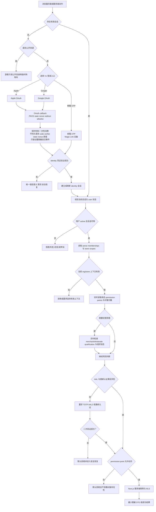
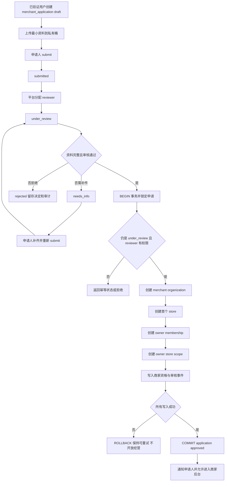
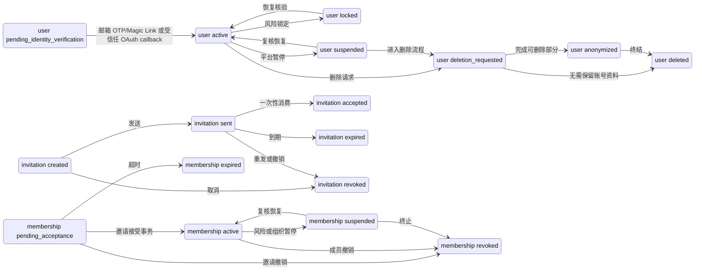
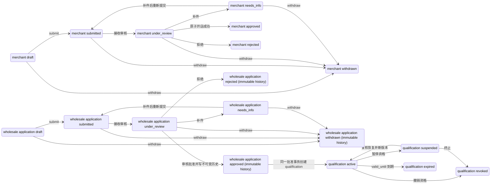
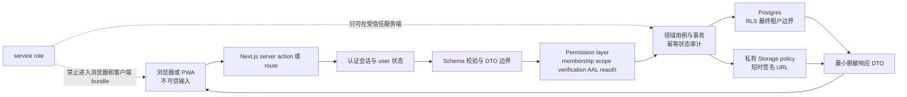

# 账号系统思维导图

文档状态：Owner 已批准进入 A0 执行，待 A0 验收  
适用范围：将 [完整账号系统规划](./07-完整账号系统规划.md) 压缩为可独立阅读的结构图、流程图和状态图  
证据边界：图示表达规划合同，不代表任何认证、审批、RLS、MFA、Storage 或生产能力已经连接。

A0/A1 交叉合同：[A0 账号架构 ADR 与威胁模型](./09-A0-账号架构ADR与威胁模型.md) · [A1 Auth spike 执行合同](./10-A1-Auth-Spike执行合同.md)。

## 1. 独立思维导图

```mermaid
mindmap
  root((Rebuy 账号系统 V1))
    边界与结论
      Owner 评审稿
      多商家批发与零售
      微信仅为业务说法
      不做微信登录导入同步 API
      规划图不等于生产能力
    四层模型
      Identity 认证
        auth.users 供应商托管
        identities email google apple
        profiles 最小资料
        V1 三入口
          Apple OAuth
          Google OAuth
          邮箱 OTP
          官方按钮且功能等价
        Magic Link 兼容
        identity linking
          同验证邮箱 A1 实测
          手动 link unlink 重新认证
          防止孤儿账号
        Apple relay 隐藏邮箱
        Apple secret 约每 6 个月轮换
        p8 受控密钥系统
        AAL1 AAL2
      Membership 组织与店铺
        organizations
        stores
        memberships
        membership_store_scopes
        用户不直接挂 store_id
        多组织切换上下文
      Authorization 角色权限
        role_definitions
        permissions
        role_permissions
        permission point
        默认拒绝
        服务端与 RLS
      Verification 经营资格
        merchant_application
        wholesale_applications 不可变审核历史
        wholesale_qualifications 当前资格
          active
          suspended
          expired
          revoked
          source_application_id
          org_id valid_from valid_until
          reason version
        verification_documents
          审批前 org_id 可空
          application_type application_id applicant_user_id 归属
          批准事务后绑定 org_id
          不能仅凭 NULL 放宽访问
        资格不等于角色
        批发价格自动适配
    账号路径
      访客
        公开浏览
        临时购物车
      零售买家
        自助注册
        本人订单地址
      批发公司
        资格申请
        组织 owner procurement billing
      商家
        入驻审批
        原子创建组织店铺 owner
      商家员工
        仅邀请
        角色与店铺 scope
      平台员工
        仅邀请
        owner admin reviewer support auditor
          support 仅收件 工单 补件沟通 脱敏状态
          reviewer 查看必要证明并作审核决定
          support 不看完整证件 不写审核意见 不批准
          auditor privacy.request.observe 只读观察
          指定处理角色 privacy.request.handle
    业务流程
      登录
        Apple Google 邮箱 OTP
        Magic Link 后备
        OAuth callback
          PKCE state nonce
          短时一次性 不持久保存原值
          只留必要脱敏安全事件
          精确 redirect allowlist
          禁止 open redirect
        统一错误语义
        速率限制
      身份绑定
        自动 linking 实测
        relay 不猜测合并
        重复业务用户人工恢复
      组织上下文
        读取 active membership
        校验 store scope
        切换后服务端重算
      邀请
        token hash
        短期一次性
        接受前证明目标邮箱控制权
        Apple/Google 邮箱必须精确匹配
        不按 relay 姓名猜测
        目标邮箱 OTP 后再 link OAuth
        或撤销并重发到已验证新邮箱
        过期撤销防重放
      商家审核
        draft
        submitted
        under_review
        needs_info
        approved
        原子开店
      批发申请审核历史
        资料与补件
        approved rejected withdrawn 后不可变
        只追加复核事件或新申请
      批发资格
        source_application_id
        active suspended expired revoked
        valid_from valid_until reason version
      权限变更
        重新认证
        会话撤销
        通知与审计
    角色与权限
      平台
        owner
        admin
        reviewer
        support
        auditor
      商家
        owner
        admin
        catalog
        inventory
        order
        support
      批发组织
        owner
        procurement
        billing
      买家
        retail buyer
      权限点
        member.invite
        scope.assign
        catalog.write
        pricing.wholesale.write
        inventory.adjust
        order.process
        verification.document.read
        audit.export
        privacy.request.observe
        privacy.request.handle
    核心数据
      auth.users
      profiles
      organizations
      stores
      memberships
      membership_store_scopes
      role_definitions
      permissions
      role_permissions
      invitations
      merchant_applications
      wholesale_applications
      wholesale_qualifications
      verification_documents 私有桶
      consent_records
      security_events
      audit_logs
      privacy_requests
      org_id tenant_id 可信派生
      敏感字段最小化
    安全
      Next server actions routes
        会话认证
        schema 校验
        permission layer
        脱敏 DTO
      Postgres RLS 最终边界
      浏览器无 service role
      不信任 user_metadata
      JWT app_metadata 可能陈旧
      Google 最小 scope
        openid email profile
        不读取 Gmail Drive 联系人
        不保存 provider token
      Apple 隐藏邮箱和姓名缺失
      OAuth 不授予业务权限
      OAuth client 按环境独立
      Apple secret 到期监控
      高风险实时查 membership status AAL
      AAL2 TOTP
        平台 owner admin reviewer 强制
        商家 owner admin Beta 前完成
        买家可选
        备用 TOTP 因子
          不同设备或安全位置
        Supabase Auth 不支持静态恢复码
          使用备用 TOTP + 受审计人工恢复
        受审计人工恢复
          身份核验
          职责分离
          AAL/会话重置
          通知与审计
      高风险重新认证
      反枚举与限流
      幂等
      会话
        signOut local global others A1 验证
        auth.sessions 可见性/服务端权限 A1 验证
        access token 撤销后可能在 exp 前有效
        高风险实时查 session_id membership
        普通请求遵循批准 JWT 时限
      安全通知
      审计无 PII
    隐私 GDPR
      数据最小化
      目的限制
      私有证明文件
      短时签名 URL
      导出
      更正
      删除
      限制处理
      订单财务法定留存分离
      legal hold
      意大利 EU 顾问最终确认
    页面
      买家端
        Apple Google 邮箱 OTP 登录
        我的与批发申请
        安全中心与 identity 管理
        隐私中心
      商家端
        入驻
        组织店铺切换
        成员邀请
        角色 scope
        安全与审计
      平台端
        审核队列
        组织成员
        权限策略
        安全事件
        隐私请求
        审计
      渐进披露
        当前任务优先
        敏感资料下钻
        不做信息墙
    阶段
      A0 ADR 威胁模型
      A1 Auth spike
        两家控制台与品牌回调
        linking MFA 密钥轮换
      A2 买家账号
        接入三种 V1 入口
      A3 组织邀请
      A4 商家批发审核
      A5 MFA 审计隐私
      A6 小范围试运行
        Apple secret 到期告警
      每阶段风险验证 Owner Gate
```

## 2. 登录与授权判定

读图说明：Apple、Google、邮箱 OTP（Magic Link 后备）都只建立 identity；OAuth callback 必须先通过 PKCE/state/nonce 和 redirect 校验。真正的组织、店铺、权限和批发资格仍在服务端逐层通过；原会话已满足 AAL 时直接判断 permission，未满足时只有二次验证成功才继续。

## 3. 商家申请、审批与原子开店

读图说明：`approved` 只能在组织、首店、owner membership、scope、资格和审计事件同一事务成功后出现。任何一步失败都不能留下半个可运营商家；批准也不产生平台角色。

## 4. 账号、成员与邀请状态

读图说明：图中三条状态线分别表示 user、membership、invitation；邀请消费和 membership 激活应在同一事务中完成。成员撤销后不能靠旧会话、旧 JWT 或旧页面恢复权限。

## 5. 商家与批发申请状态

读图说明：商家 `approved` 依赖原子开店；批发申请的 `approved`/`rejected`/`withdrawn` 只是不可变审核历史，当前价格资格由独立 `wholesale_qualifications` 的 `active`/`suspended`/`expired`/`revoked` 状态决定。申请历史不能原地改写，资格变更通过来源申请、有效期、reason 和 version 追加审计；拒绝、撤回、到期和撤销不能通过改前端标签恢复。

## 6. 数据访问防线

读图说明：浏览器只能提出请求；Next.js 服务端负责认证、校验、授权和 DTO；领域事务负责状态和幂等；Postgres RLS 与私有 Storage policy 形成最终数据边界。service role 是服务端秘密，不能经浏览器传递。

## 7. 关键红线

- 登录账号不等于商家、店铺成员、平台员工或批发权限；四层事实必须分别核验。
- Google/Apple OAuth 只建立 identity，不直接授予 membership、角色、商家批准或批发资格；authorization code、PKCE verifier、state、nonce 短时一次性，消费后不持久保存原值，只留必要脱敏安全事件。
- Google 只请求 `openid`、`email`、`profile`；不读取 Gmail、Drive、联系人或 iCloud 数据，不保存 provider token。
- OAuth callback 必须验证 PKCE/state/nonce（按流程）和精确 redirect allowlist，禁止 open redirect，三环境 client/secret/品牌配置独立。
- Apple relay 邮箱和姓名缺失必须正常支持；不强制真实邮箱，`.p8` 只进受控密钥系统，Web OAuth secret 约每 6 个月轮换并告警。员工接受邀请前必须证明目标邮箱控制权；Apple/Google 当前 identity 邮箱不精确匹配即拒绝，不按 relay 或姓名猜测。
- 邀请的可行修复只有目标邮箱 OTP 验证后再 link OAuth，或由邀请人撤销并重发到已验证的新邮箱。
- 同验证邮箱自动 linking 先在 A1 实测；不按 relay、姓名、头像、未验证邮箱或组织关系猜测合并，手动 unlink 必须保留至少一种可用登录方式。
- 两个 identity 已形成两个业务用户时，不自动搬运订单、membership 或商家/批发资格，只进入受审计人工恢复/合并流程。
- `users`/`profiles` 不直接挂 `store_id`；多组织用户必须通过有效 membership 和 store scope 切换上下文。
- 不用角色名、客户端开关、`user_metadata`、可陈旧的 JWT/app_metadata 或 URL 参数单独授权。
- Next.js 服务端授权和 Postgres RLS 都必须存在；默认拒绝，任何越权读取、写入、搜索、聚合和 Storage 访问都要失败。审批前 `verification_documents` 的 `org_id` 可空，但 RLS/Storage 必须匹配 `application_type/application_id/applicant_user_id`；批准事务后才绑定 `org_id`，不能仅凭 NULL 放宽访问。
- 商家批准必须原子创建组织、店铺、owner membership、scope、资格和审计；失败不能开放半成品。
- 平台 owner/admin/reviewer 强制 AAL2/TOTP；商家 owner/admin 在 Beta 前完成；备用 TOTP 因子必须在不同设备/安全位置；人工恢复必须身份核验、职责分离、AAL/会话重置、通知和审计；高风险动作重新认证并通知。
- Supabase Auth 不支持静态恢复码；使用备用 TOTP + 受审计人工恢复。备用因子必须位于不同设备或安全位置，人工恢复必须身份核验、职责分离、AAL/会话重置、通知和审计。
- `privacy.request.observe` 只允许 auditor 只读观察；`privacy.request.handle` 只给指定实际处理角色，默认拒绝并保留职责分离。
- support 仅收件、工单、补件沟通和脱敏状态，不能看完整证件、写审核意见或批准；reviewer 才能查看必要证明并作决定。证明文件只进私有桶并通过短时签名 URL；日志、DTO、错误和审计摘要不放完整 PII、token 或 service role。
- `signOut` 的 local/global/others 先由 A1 验证；单设备列表/撤销只有在 `auth.sessions` 可见性与服务端权限验证后才承诺。被撤销 access token 可能在 `exp` 前有效，高风险请求实时查 session_id/membership，普通请求遵循批准 JWT 时限。
- 本 V1 正式入口是 Apple、Google、邮箱 OTP，Magic Link 兼容/后备；密码与 Passkey 后置，仍不做手机短信登录、微信登录、微信导入、同步或 API。
- 意大利/EU GDPR、税务留存、删除例外和处理者合同必须由法律与税务顾问最终确认。
