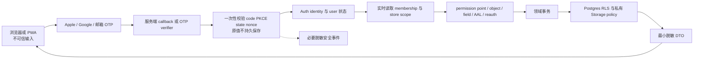
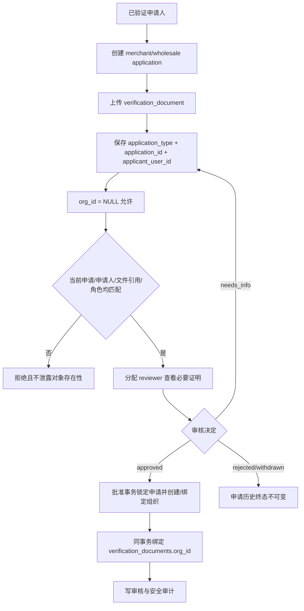

# A0 账号架构 ADR 与威胁模型

文档状态：G2-A0 Exit GO；远端 docs-only reconciliation 已获批、尚未执行（本次修复 closeout head 待独立复审）；Entry 已授权，七项 Owner 政策已于 2026-08-27 采纳
适用范围：Rebuy 多商家、批发与零售平台的身份、组织、权限、经营资格、文件和隐私信任边界  
证据边界：本文是 A0 架构决定和威胁模型执行合同，不代表已连接 Supabase、OAuth、SMTP、Storage、数据库或生产环境。  
关联文档：[完整账号系统规划](./07-完整账号系统规划.md)、[账号系统思维导图](./08-账号系统思维导图.md)、[A1 Auth spike 执行合同](./10-A1-Auth-Spike执行合同.md)、[G2-A0 阶段记录](./stages/G2-A0-账号安全合同与威胁模型验收.md)。

## 1. A0 目标与范围

A0 要锁定账号系统在 A1 之前不能再被实现代理自行改变的安全边界：

- identity、membership、authorization、verification 四层事实分离。
- 组织/店铺是租户边界，服务端授权和 Postgres RLS/Storage policy 默认拒绝。
- 商家入驻、批发申请、批发当前资格和证明文件具有不同生命周期和归属规则。
- 邀请接受先证明目标邮箱控制权；Apple relay、Google identity 和姓名不能被用来猜测账号归属。
- Owner 已于 2026-08-27 采纳：MFA 恢复排除 phone/SMS MFA 与静态恢复码，采用不同设备/安全位置的备用 TOTP 因子＋受审计人工恢复；供应商能力与实现证据仍待 A1 验证。
- 会话能力必须根据 Supabase 实测校准；未验证的设备列表、单设备撤销和即时 access token 失效不得被写成承诺。
- OAuth 短时材料一次性消费，不持久保存原值，只留下必要的脱敏安全事件。
- support、reviewer、auditor、platform admin 的读写和决定权限分离。

2026-08-27 Owner 已签署 G1-19、G1 Exit=GO，并授权打开 G2-A0。G2-A0 Exit 已 GO（验收 ref=`140ea15d9c3f178a326709d35ad1750a156df0d1`），当前仅维护已批准且尚未执行的 docs-only reconciliation；前一 exact-head 独立文档治理审查 findings `none/GO`，本次修复 closeout head 待独立复审，G2-A1 保持未开始。不授权 Supabase/Auth/DB/Storage/Realtime、secret/env、真实账号或任何部署/外部资源写入。

本 A0 只覆盖账号、组织、权限、资格、证明文件、会话、MFA、OAuth、隐私和相关审计。商品、订单、支付、税务、物流和生产部署仍受 00、04、05 的独立阶段门禁约束。

## 2. ADR 决定

| ADR | 决定 | 理由与约束 | 后续验证/门禁 |
|---|---|---|---|
| A0-01 | 采用四层模型：认证 identity、组织/店铺 membership、permission-point authorization、经营资格 verification | 登录成功不等于组织成员、平台角色或批发资格；每层必须有独立状态、归属和审计 | A1 验证 Auth 入口；A2–A4 验证业务表、服务端授权和 RLS |
| A0-02 | Owner 已采纳 A1 优先验证 Supabase Auth，Clerk/Auth0 仅作比较；A0 不锁定最终 provider、不连接环境 | Auth 供应商只托管 identity、会话和因子；组织、店铺、membership、权限、申请、资格和审计真源属于 Rebuy | A1 在独立环境比较 Supabase/替代方案；最终选择仍需 A1 evidence/Owner 决策 |
| A0-03 | `verification_documents.org_id` 审批前允许 NULL | 审批前组织可能尚不存在，NULL 是生命周期事实而不是公开访问条件 | A4 证明 RLS/Storage 同时匹配 `application_type/application_id/applicant_user_id`；批准事务成功后绑定 `org_id` |
| A0-04 | 审批前文件归属由申请三元组和申请人形成 | `application_type`、`application_id`、`applicant_user_id` 必须同时匹配当前申请、当前用户、文件引用和授权角色；只凭 `org_id IS NULL` 一律拒绝 | A0 设计检查；A4 负向测试、Storage policy 和签名 URL 故障注入 |
| A0-05 | `wholesale_applications` 与 `wholesale_qualifications` 分离 | 申请是不可变审核历史；资格是当前可用的业务状态，必须能独立暂停、到期或撤销 | A4 验证批准事务、版本、价格/结算实时检查和历史不可改写 |
| A0-06 | 批发申请终态不可变 | `approved`、`rejected`、`withdrawn` 进入后不原地改写主体、文件、决定或理由；修正走追加事件或新申请 | A4 验证并发、重复批准、人工复核和追加审计 |
| A0-07 | 当前资格实体只允许 `active`、`suspended`、`expired`、`revoked` | 资格字段包括 `source_application_id`、`org_id`、`valid_from`、`valid_until`、`reason`、`version`；只有 active 且其他实时条件满足时参与批发价格 | A4 负向验证 JWT/cache 陈旧、资格失效、结算前复核 |
| A0-08 | 邀请接受必须证明邀请目标邮箱控制权 | Apple/Google identity 的已验证邮箱必须与目标邮箱精确匹配；relay 和姓名不能推断匹配 | A1 验证目标邮箱 OTP→link OAuth、拒绝不匹配、撤销重发和通知 |
| A0-09 | MFA 边界：主 TOTP、不同设备/安全位置的备用 TOTP、受审计人工恢复；Owner 已采纳排除 phone/SMS MFA 与静态恢复码 | 备用因子必须在不同设备或安全位置；人工恢复需要身份核验、职责分离、AAL/会话重置、通知、限速和审计；support 不得单独批准；六类高风险动作禁止自审并实行双人复核 | A1 验证因子生命周期；A5 进行高风险流程和恢复专项审查；实现证据仍未开始 |
| A0-10 | 会话先校准原生退出语义 | 先验证 Supabase `signOut` 的 `local`、`global`、`others`；`auth.sessions` 可见性、服务端权限、设备列表和单设备撤销在 A1 前不承诺 | A1 记录实测能力；高风险请求实时查 `session_id`/membership；普通请求按批准 JWT 时限 |
| A0-11 | 被撤销 access token 的窗口按风险处理 | access token 可能在 `exp` 到期前仍有效；高风险动作必须实时检查 session、用户、membership、组织/店铺和资格，不能只看 JWT | A1/A2 记录观察证据；A3–A5 做撤销后负向测试 |
| A0-12 | user 初始状态命名为 `pending_identity_verification` | 邮箱 OTP/Magic Link 与受信任 OAuth callback 都能完成 identity verification 并转 active；不是只有邮箱验证路径 | A1 覆盖三入口和失败/取消路径 |
| A0-13 | support 与 reviewer 职责分离 | support 仅收件、建工单、补件沟通和维护脱敏状态，不看完整证件、不写审核意见、不批准；reviewer 才能查看必要证明并作审核决定 | A0 权限矩阵；A4 用字段级 DTO、RLS 和负向测试证明 |
| A0-14 | OAuth 短时材料不持久保存原值 | authorization code、PKCE verifier、`state`、`nonce` 短时一次性并绑定发起会话；只保留必要脱敏安全事件 | A1 检查日志、错误、数据库、缓存、Storage 和监控输出 |
| A0-15 | 本地视觉原型不是安全证明 | 原型可以演示入口、身份样本和状态文案，但不能证明 callback、RLS、Storage、MFA、会话撤销、租户隔离或隐私处理 | A1–A6 必须提供独立运行证据；Owner Gate 不能用截图替代 |

## 3. 非决定与明确排除

以下事项在 A0 不锁定，不能由执行代理凭经验补齐：

- Supabase 项目、区域、版本、数据库迁移、Auth/Storage policy、JWT 时限和生产密钥。
- Google/Apple 控制台、品牌同意页、redirect URI、Apple `.p8` 保管人、SMTP 发件域和正式模板。
- 同验证邮箱自动 linking 是否可用、link/unlink 的最终交互、重复业务用户的人工合并政策。
- `auth.sessions` 是否对业务服务端可读、能否稳定列出设备、单设备撤销的实现和即时性。
- 意大利/EU GDPR、税务留存、删除/匿名化、legal hold、跨境传输和处理者合同的最终法律意见。
- 批发资格的商业条件、有效期、审核 SLA、申诉和价格/订单快照规则。
- 真实客户、真实商家、真实证件、真实邮箱、真实订单、生产 PII 或生产业务写入。

## 3.1 2026-08-26 Entry preflight 安全补充（历史预检；2026-08-27 政策已采纳）

本节是独立只读安全预检的历史合同补充，不是自动生效的运行时授权，也不代表已连接 Supabase/Auth、数据库、Storage 或任何外部项目。原记录日 2026-08-26 的 G1 Exit 快照为 NO-GO；2026-08-27 已由 Owner 以 G1-19/ref=`d51f1c7cb47e2fe2932b29bd39420f5d092a8160` 签署 G1 Exit=GO 并打开 G2-A0 docs-only 执行。七项政策已由 Owner 采纳，前一 exact-head `140ea15d9c3f178a326709d35ad1750a156df0d1` 的独立文档治理审查 findings `none/GO`；G2-A0 Exit 已 GO，新 closeout head 仍待独立复审，G2-A1 保持未开始。完整记录见[G2-A0 Entry preflight 证据](./evidence/G2-A0/2026-08-26-entry-preflight/README.md)和[G2-A0 阶段记录](./stages/G2-A0-账号安全合同与威胁模型验收.md)。

官方页面只作为 2026-08-26 的规划依据，实施时须按实际版本、区域和项目重新核验： [Securing your API](https://supabase.com/docs/guides/api/securing-your-api)、[Row Level Security](https://supabase.com/docs/guides/database/postgres/row-level-security)、[Database Functions](https://supabase.com/docs/guides/database/functions)、[Storage Access Control](https://supabase.com/docs/guides/storage/security/access-control)、[SSR client](https://supabase.com/docs/guides/auth/server-side/creating-a-client)、[sessions](https://supabase.com/docs/guides/auth/sessions)、[MFA](https://supabase.com/docs/guides/auth/auth-mfa) 和 [managed schema restrictions](https://supabase.com/changelog/34270-restricting-access-on-auth-storage-and-realtime-schemas-on-april-21-2025)。本批只读官方网页，不执行 provider/project 连接。

| 预检控制 | 合同补充 | 后续责任与证据 |
|---|---|---|
| 删除、暂停、撤销与 session/token 窗口 | 删除或暂停用户、membership、组织、店铺或资格前后，不把旧 access token 视为即时失效；现有 token 可能持续到 `exp`，高风险请求按风险实时校验 `session_id`、user、membership、scope 和资格，刷新 token 的窗口、退出和通知也要记录。 | A1 观察 session/token 时间窗口、`signOut`、删除/暂停前后行为和并发；A3/A4 验证成员/资格撤销后的业务拒绝与跨租户负向；不承诺未实测的即时踢出。 |
| Data API grants、RLS 与 exposed allowlist | grants 决定 `anon`/`authenticated`/服务端角色能否到达暴露对象，RLS 决定可见/可修改行；两层都必须最小化，暴露表、view、function 使用显式 allowlist，不能因有 RLS 或 publishable key 就跳过 grants/服务端授权。 | A1 做最小对象/角色核验；A3/A4 验证完整业务对象、跨租户查询和拒绝路径。 |
| UPDATE 的三项条件 | 每个可更新对象必须先有相应 `SELECT` 能力，并同时约束旧行 `USING` 与新行 `WITH CHECK`；缺任何一项都不能进入业务实现。 | A3/A4 用跨租户、改 owner/org 的负向测试和 policy 审查证明；本节不提供 SQL 实现。 |
| view 的 RLS 边界 | 暴露 view 默认不能被当成自动继承表级 RLS；优先采用 `security_invoker`，否则放入非暴露 schema 并建立等价拒绝/授权证据。 | A3/A4 验证 view 的角色、行范围和字段 DTO；未验证前不暴露 view。 |
| SECURITY DEFINER/function 权限 | 默认使用 invoker；只有有理由时才使用 `SECURITY DEFINER`，并固定 `search_path`、显式 schema-qualified 引用，撤销 `PUBLIC EXECUTE`，再向明确角色 allowlist 授权；不以它绕过 RLS 修复权限问题。 | A3/A4 做 function 调用、角色切换、search_path 和越权负向测试；A0 只锁定原则，不创建函数。 |
| Storage upsert | 允许对象替换的 `upsert` 必须同时满足 `INSERT`、`SELECT`、`UPDATE` 的 Storage policy/权限；桶保持私有，文件归属和签名 URL 仍按申请/组织边界校验。 | A4 验证上传、替换、读取、删除、对象 key 和跨租户拒绝；未实测不承诺 upsert。 |
| managed `auth`/`storage`/`realtime` schema | 不在供应商 managed schema 创建/删除表或函数，不修改其迁移表或做破坏性写入；自有表、函数和迁移放在自有受控 schema，能引用 managed 表但不接管其对象。 | A1/A3/A4 复核迁移和 schema 约束；实现当天按官方 breaking-change 页面重验，不连接当前项目。 |
| SSR 每请求 client、Proxy/cookie refresh 与并发 | 浏览器和服务端 client 都使用工厂按调用创建；SSR 每请求建立新 client，未来 Proxy 负责刷新 token 并写回 request/response cookies；并发请求、过期 session、刷新竞态和用户串线必须实测。 | A1 在独立测试环境运行并发/过期矩阵；当前仓库只有连接骨架，没有 Proxy 运行证据。 |
| provider/plan/region/session 矩阵 | provider、plan、region、session lifetime、single-session、refresh delay 必须作为同一矩阵记录版本、配置、观察窗口和限制；不凭文档或默认值推断产品能力，不在本批选定具体供应商/区域/时长。 | A1 实测并由 Owner 选择；结果影响 signOut、设备管理和高风险授权，不提前承诺。 |
| V1 MFA 范围 | Owner 已于 2026-08-27 采纳 V1 排除 phone/SMS MFA；正式因子为 TOTP、不同设备/安全位置的备用因子和受审计人工恢复。 | A1 按已采纳范围不测试 phone/SMS；仍验证 TOTP、恢复、AAL/会话重置、通知和审计的实现证据。 |
| publishable key 与授权 | publishable key 可以出现在浏览器，但只是连接/API key，不是授权边界；服务端 permission layer、grants、RLS、Storage policy 和业务状态才共同决定授权。`service_role`/secret 永不进浏览器、bundle、日志或 URL。 | A1/A3/A4 做 bundle、Network、grants/RLS 和服务端授权检查；不读取或写入任何真实 key。 |
| 静态恢复码政策 | Owner 已于 2026-08-27 采纳 V1 排除静态恢复码；备用 TOTP 必须位于不同设备/安全位置，人工恢复必须受审计。 | A1 记录实际因子/恢复能力，A5 复核高风险恢复；不把供应商界面命名当作政策。 |

## 4. 数据流与生命周期

### 4.1 登录与授权数据流

`pending_identity_verification` 用户只能完成 identity 验证和受限恢复，不可读取受保护业务对象。active 也不自动拥有 membership、角色或资格；每次请求必须重新计算组织/店铺上下文和风险条件。

### 4.2 审批前证明文件数据流

审批前 `org_id = NULL` 只表示组织尚未建立。RLS 和 Storage 授权必须匹配申请三元组、申请状态、申请人身份和 reviewer 分配范围；任何只写 `org_id IS NULL` 的策略都是 A0 失败。

### 4.3 批发申请与当前资格

`wholesale_applications` 负责申请、补件、审核决定和不可变历史。批准事务创建 `wholesale_qualifications`，带 `source_application_id`、`org_id`、`valid_from`、`valid_until`、`reason`、`version`。资格状态只允许 `active`、`suspended`、`expired`、`revoked`；价格或结算前必须实时检查 qualification、membership、组织状态和商品规则。

### 4.4 邀请与身份绑定

1. 邀请保存目标邮箱规范化摘要、token hash、组织、scope、角色版本和期限。
2. 接受者先证明目标邮箱控制权。Apple/Google 当前 identity 的已验证邮箱不是目标邮箱时，立即拒绝。
3. 允许目标邮箱 OTP 成功后，再进入需要重新认证的 OAuth linking 流程；或者邀请人撤销并重发到已验证的新邮箱。
4. 任何 relay、姓名、头像、组织关系或相似资料都不能替代邮箱控制权证明。
5. 邀请 token 与 membership 激活必须幂等、一次性、同一事务完成，并产生通知和审计。

## 5. 资产与数据分类

| 资产 | 分类 | 主要风险 | 最小控制 |
|---|---|---|---|
| Auth identity、邮箱、provider identity | 高敏感账户资料 | 账号接管、枚举、重复业务用户 | 最小 scope、反枚举、MFA、通知、identity linking 门禁 |
| access/refresh token、cookie、session_id | 极高敏感安全材料 | 会话劫持、撤销延迟、重放 | HttpOnly/安全 cookie 设计、短时策略、服务端 session 检查、禁止日志原值 |
| OAuth code、PKCE verifier、state、nonce | 极高敏感短时材料 | callback 劫持、CSRF、重放 | 一次性、短时、绑定发起会话、消费后不持久保存原值 |
| 主 TOTP 与备用 TOTP 因子元数据 | 极高敏感账户资料 | MFA 绕过、锁死、恢复滥用 | 已采纳不同设备/安全位置、AAL2、重新认证、人工恢复职责分离；AAL2 角色/时点按 Owner 决定执行 |
| 组织、membership、scope、permission point | 高敏感授权资料 | 跨租户读取、权限自提、撤销延迟 | 服务端重算、RLS、状态检查、版本和审计 |
| 商家/批发申请历史 | 极高敏感业务资料 | 审批篡改、身份冒用、合规争议 | 不可变终态、版本化更正、reviewer 分配和审计 |
| `wholesale_qualifications` | 极高敏感经营资格 | 批发价泄露、资格滥用、过期继续购买 | source application、有效期、reason/version、实时价格/结算校验 |
| 证明文件和私有附件 | 极高敏感 PII | 文件越权、公开链接、恶意文件 | 私有 Storage、申请三元组、短时签名 URL、内容和引用校验 |
| 安全事件、审计、隐私请求 | 高敏感合规资料 | 日志 PII、审计删除、内部滥用 | 脱敏、追加式、最小读取、导出复核和 legal hold |
| 订单/地址/客户最小资料 | 高敏感交易资料 | 商家间泄露、删除与法定留存冲突 | 订单/组织 scope、字段级 DTO、留存与匿名化分离 |

## 6. 信任边界

| 边界 | 不可信一侧 | 可信责任 | 必须证明 |
|---|---|---|---|
| 浏览器到服务端 | URL、表单、cookie、客户端角色、文件名、切换的 org/store | Next.js server action/route | session、schema、membership、scope、permission、AAL、DTO |
| 服务端到数据库 | 领域输入、事务参数、用户候选 org/store | 受信服务端 + PostgreSQL RLS | 可信租户派生、对象归属、状态、幂等和审计 |
| 服务端到 Storage | 文件 key、签名 URL 请求、申请 ID | 私有 policy + 服务端签名层 | 申请三元组、申请状态、角色和 file reference |
| OAuth provider 到 callback | provider 返回、code、错误、redirect 参数 | callback verifier | provider、code、PKCE/state/nonce、环境、重放和 allowlist |
| support 到 reviewer | 工单字段、脱敏状态、补件沟通 | 权限和职责分离策略 | support 不能看完整证明、写决定或批准；reviewer 在分配范围内决定 |
| 业务数据库到客户端 | 业务行、内部审核字段、PII | DTO/字段策略 | 只返回当前任务所需且已授权字段 |
| local/preview-staging 到 production | 配置、密钥、数据、域名、redirect | 环境与密钥隔离 | 不共享项目、密钥、Storage、SMTP、真实 PII 或生产连接 |

## 7. STRIDE 威胁模型与滥用场景

### 7.1 STRIDE 对照

| 类别 | 账号系统场景 | 主要控制 | A0/A1 证据 |
|---|---|---|---|
| Spoofing 欺骗 | 盗用邮箱、Apple relay、Google identity 或邀请链接 | 邮箱控制权、MFA、精确 identity linking、token hash、通知 | A1 登录/邀请/relay 矩阵；A4 申请主体核验 |
| Tampering 篡改 | 改角色、scope、批发资格、申请终态、审核意见或文件引用 | 服务端 permission point、RLS、不可变历史、版本、事务和追加审计 | A0 数据不变量；A3/A4 故障注入和负向测试 |
| Repudiation 抵赖 | 否认登录、MFA 恢复、审批、邀请接受或隐私处理 | request_id、session 摘要、操作者、AAL、前后状态、通知和追加式 audit | A1/A4/A5 事件字段和导出审查 |
| Information disclosure 信息泄露 | 跨组织查询、完整证件、OAuth 原值、内部审核备注、provider token | DTO 脱敏、最小字段、私有桶、短时 URL、原值不落库/日志 | A1 日志扫描；A4 RLS/Storage 负向 |
| Denial of service 拒绝服务 | OTP/邀请/MFA/恢复滥用、文件上传、审计导出 | 分动作限流、大小/类型限制、人工队列、熔断和停止开关 | A1 限流演练；A5 运维和恢复 |
| Elevation of privilege 权限提升 | JWT 陈旧、客户端 metadata、客服冒充 reviewer、审批自审 | 实时业务状态、AAL/重新认证、职责分离、reviewer 分配、RLS | A2–A5 负向矩阵和独立审查 |

### 7.2 重点滥用场景

| 场景 | 攻击路径 | 必须拒绝/保护的结果 | 责任与证据 |
|---|---|---|---|
| 租户越权 | 用户 A 替换 `org_id`、`store_id`、order ID、Storage key 或分页过滤器 | 不读、不写、不聚合、不返回对象存在性线索 | server authorization + RLS；A3/A4 负向测试 |
| 陈旧资格提权 | JWT/app_metadata 仍保留旧批发角色，资格已 suspended/expired/revoked | 价格和结算回到零售/不可购买；高风险业务拒绝 | 资格实时查；A4 价格/结算测试 |
| 账号接管 | 攻击者控制邮箱、OAuth callback、邀请 token 或主 MFA 设备 | 未证明目标邮箱/二次因子不得激活 membership 或高风险会话 | A1 callback、邀请、MFA 证据 |
| 邀请错收 | Apple relay 或 Google identity 与邀请目标邮箱不匹配，用户试图接受 | 拒绝；不得按姓名/relay 猜测；只允许目标邮箱 OTP→link 或撤销重发 | A1 invitation matrix；A3 审计 |
| Linking 绑错账号 | 同姓名/头像/组织关系或不同 relay 被自动视为同一人 | 不自动合并，不搬运订单、membership、资格或审计；进入人工冲突流程 | A1 identity linking；A2 冲突记录 |
| MFA 恢复滥用 | support 以工单理由替管理员解除 MFA，或主/备用因子同处一设备 | support 无批准权；按 Owner 已采纳政策需身份核验、职责分离、AAL/会话重置、通知审计；MFA 人工恢复属于六类高风险动作，必须双人复核且禁止自审 | A1/A5 恢复演练和已采纳政策的实现证据 |
| 审批前文件越权 | 查询 `org_id IS NULL` 或猜测对象 key 获取申请文件 | NULL 不产生访问权；必须匹配申请三元组、申请人和分配 reviewer | A4 RLS/Storage 负向 |
| 文件公开/恶意上传 | 公开 bucket、可枚举文件名、伪造 MIME、超大或恶意内容 | 私有桶、签名短时 URL、类型/大小/内容检查、引用关系检查 | A4 文件测试、日志检查 |
| support 越权审核 | support 读取全文证件、写“审核通过”、调用 approve | DTO、权限点和 API 层拒绝；support 只能处理工单/补件/脱敏状态 | A0 角色矩阵；A4 负向 |
| OAuth 原值泄露 | code/verifier/state/nonce 进入数据库、日志、URL、截图或长缓存 | 原值短时一次性；只保留必要脱敏事件 | A1 日志/缓存/错误输出扫描 |
| 会话撤销误判 | 单设备撤销被当作已实现，或 access token 在 exp 前仍被信任 | 未验证能力不承诺；高风险实时查 session_id/membership，普通请求按 JWT 时限 | A1 `signOut`/`auth.sessions` 实测 |
| 隐私删除越权 | 删除请求抹掉法定订单/审计或泄露他人资料 | 先验证主体、范围、legal hold 和法定留存；输出只含本人最小资料 | A5 隐私专项审查 |

## 8. 关键安全不变量

1. 没有有效 session、active user、有效 membership/scope、permission point、对象归属、业务状态和所需 AAL 时，默认拒绝。
2. `NULL org_id` 是审批前生命周期状态，不是共享租户；申请三元组是审批前文件的最小归属条件。
3. `wholesale_applications` 的 `approved`、`rejected`、`withdrawn` 是不可变历史；当前资格只由 `wholesale_qualifications` 和实时组织/member/product 条件决定。
4. `support` 不具备完整证件读取、审核意见写入或批准能力；`reviewer` 只能在分配案例中查看必要证明并作决定。
5. Apple/Google identity 不能绕过邀请目标邮箱控制权；relay、姓名、头像和组织关系不是邮箱证明。
6. Owner 已采纳：备用因子必须与主因子处于不同设备或安全位置；人工恢复不能由单一 support 人员完成；平台 owner/admin/reviewer 上线前、商家 owner/admin 最迟 Beta 前强制 AAL2，普通买家按风险提升，高风险动作重新认证；六类高风险动作必须双人复核且禁止自审。
7. OAuth 短时材料原值不进入持久存储、日志、URL、截图或客户端响应。
8. access token 撤销不被假定为立即失效；高风险请求以实时 session/member/qualification 为准。
9. 本地视觉原型只能证明页面/交互合同，不能证明以上任何后端安全不变量。

## 9. 风险登记

| 风险 | 当前状态 | 责任人/阶段 | 关闭证据 | 未关闭时处理 |
|---|---|---|---|---|
| Supabase Auth 与替代供应商能力差异 | 未验证 | A1 / Owner | 三入口、MFA、会话、linking 结果表 | 不锁供应商，不接真实账号 |
| `auth.sessions` 可见性和单设备撤销 | 未验证 | A1 | 可见字段、服务端权限、撤销效果和 token 窗口记录 | 只使用已验证 `signOut` 语义，不开放单设备承诺 |
| OAuth/Apple relay linking 误合并 | 未验证 | A1/A2 | mismatch 拒绝、OTP→link、人工冲突记录 | 默认拒绝，不自动合并 |
| 审批前文件 RLS/Storage 归属 | 设计已决定，未实现验证 | A4 | 三元组负向测试、签名 URL 和事务绑定 | 不连接 Storage，不进入真实申请 |
| 批发申请历史与资格状态混淆 | 设计已决定，未实现验证 | A4 | 两实体状态/版本/事务和价格测试 | 不开放批发价格 |
| MFA 人工恢复单点滥用 | Owner 已采纳控制，尚未演练 | A1/A5 | 身份核验、职责分离、AAL/会话重置、通知、审计；MFA 人工恢复按六类高风险动作双人复核且禁止自审 | 不允许 support 单独恢复；A1/A5 未形成运行证据前保持关闭 |
| support/reviewer 职责漂移 | 已定义，待权限验证 | A4/A5 | 角色/字段/API 负向矩阵 | support 仅保留工单和脱敏状态 |
| OAuth 原值落日志或缓存 | 已定义，待扫描 | A1 | 数据库/日志/错误/缓存检查 | 停止 A1，删除测试原值并修正采集链路 |
| 隐私留存与删除冲突 | 未决法律问题 | A5 / Owner + 顾问 | 法律/税务意见、legal hold 和演练 | 不处理真实 PII |

## 10. A0 验收标准与 Exit 待签署条件

A0 通过前，Owner 或指定审查人必须能从 07、08、09 逐项核对：

- 四层模型、非目标、租户不变量和默认拒绝原则一致。
- `verification_documents` 审批前 `org_id` 可空，但申请三元组、申请人、申请状态、reviewer 范围和 Storage/RLS 约束明确；没有 NULL 放宽访问。
- 批发申请与批发资格拆分；申请终态不可变；资格字段和四种当前状态完整；批准事务和版本规则完整。
- 邀请目标邮箱控制权、Apple/Google mismatch 拒绝、OTP→link 或撤销重发路径明确；没有 relay/姓名猜测合并。
- user 状态使用 `pending_identity_verification`；邮箱 OTP/Magic Link 和受信任 OAuth callback 都能转 active。
- support/reviewer 读写和决定边界可执行，support 不得看完整证件、写审核意见或批准。
- MFA 备用 TOTP 不同设备/安全位置、人工恢复身份核验、职责分离、AAL/会话重置、通知和审计已按 Owner 2026-08-27 决定形成合同；平台 owner/admin/reviewer 上线前、商家 owner/admin 最迟 Beta 前强制 AAL2，普通买家按风险提升，高风险动作重新认证；六类高风险动作双人复核且禁止自审，运行实现证据仍待 A1/A5。
- OAuth code、PKCE verifier、state、nonce 的原值不持久保存，只有必要脱敏事件保留。
- `signOut` local/global/others、`auth.sessions`、access token `exp` 窗口和高风险实时检查的 A1 未验证事项已标记，未作过度承诺。
- STRIDE、滥用场景、风险登记、证据级别和失败后停止路径齐全。
- 明确本地视觉原型不是安全证明，且本轮没有 Supabase/OAuth/SMTP/Storage/生产连接或真实 PII。

## 11. Owner Gate

Owner Gate A0 的通过决定只允许打开 [A1 Auth spike 执行合同](./10-A1-Auth-Spike执行合同.md)的准备门，不等于批准连接环境或进入真实账号。七项政策已由 Owner 于 2026-08-27 采纳，G2-A0 Exit 已 GO；本次 closeout 新 exact-head 仍需独立复审后才可执行远端 reconciliation。Owner Gate 记录如下：

1. 七项政策及本 ADR 的 `A0-01～A0-15`、日期化 Entry 补充和上述安全不变量已接受并写入；未列入七项的实现细节仍须对应阶段决策，不得由实现代理推断。
2. 接受 A1 只能连接独立 local/preview-staging，绝不连接 production 或真实 PII；这不等于批准资源或费用。
3. 在单独的资源/成本/secret Gate 中指定 A1 的 non-production 环境、provider、计划、区域、密钥和 Google/Apple/SMTP 责任人；A0 不锁定或授权这些事项。
4. decision-ready baseline `9b11f375080db68353dd6952774bcd5e75c4153c` 的独立文档治理审查已完成（findings `none/GO`），覆盖身份、隐私、Storage、RLS、跨租户、会话和威胁矩阵的一致性；这不是运行时或 Auth/安全测试，A4/A5 仍必须专项审查。
5. Owner 已签署 A0 Exit GO；本次 closeout 新 exact-head 复审和 exact-head Actions 成功后，才可按已批准边界执行远端 docs-only reconciliation；A1 仍保持“未开始/待资源授权”，不得因七项政策或文档审查直接开始 Auth 实测。

## 12. 正式来源与交叉链接

- [Supabase Auth MFA JavaScript reference](https://supabase.com/docs/reference/javascript/auth-mfa)
- [Supabase signOut](https://supabase.com/docs/guides/auth/signout)
- [Supabase MFA guide](https://supabase.com/docs/guides/auth/auth-mfa)
- [Supabase sessions](https://supabase.com/docs/guides/auth/sessions)
- [European Commission: GDPR principles](https://commission.europa.eu/law/law-topic/data-protection/information-business-and-organisations/principles-gdpr_en)

本文件与 07/08 的交叉链接只用于规划一致性；任何链接、Mermaid 图、静态检查或本地原型都不能替代 A1 实测、RLS/Storage 负向测试、独立审查或 Owner 的后续生产 Gate。

## 13. 2026-08-27 G2-A0 Exit closeout 当前状态

- G2-A0 Exit 已由 Owner 以 ref=`140ea15d9c3f178a326709d35ad1750a156df0d1` 于 2026-08-27 签署 GO；当前为 `Exit GO；远端 docs-only reconciliation 已获批、尚未执行`。前一 exact-head 独立文档治理审查 findings=`none/GO`，范围为文档治理一致性，不是 Auth/MFA/DB/RLS/Storage 或运行时测试；本次修复 closeout head 待独立复审。
- 本次授权承接紧前完整 docs-only 外发文本：公开 12 个 Markdown、相关 Git 历史、Owner 姓名、账号安全架构、威胁模型、角色权限和阶段治理信息到 `kyox215/REBUY_SHARE`；非强制 branch push/PR/`prototype-quality` Actions 和条件式 merge commit 均须通过 docs-only、exact-head Actions 和独立复审条件。
- 远端 preflight（140ea 历史）记录为 `main=7ea1e45ad22ab29105910665baf4bbd7212241c5`、目标 branch/PR 无；公开外发审计为 12 个 Markdown、`351437` bytes，无 binary/image/secret/phone/address/customer PII，且新增内容审计未发现新增邮箱但漏计继承内容。base/public main 及既有 Git author metadata 已含同一 Owner 邮箱，G2-A0 未引入不同邮箱；当前 G2-A0 12 路径候选中 docs/15 的 Owner 邮箱正文已脱敏；未改动的既有历史/evidence 文档及 Git author 历史可能仍含同一邮箱；不可声称 Git 历史无 email。Owner 此前明确授权公开仓库 Git 历史且最新消息同意当前闭环；此前 push 审批被拒且远端写入为零。本地修复 closeout head 未完成独立复审前不预写 PR、Actions run 或 merge；提交后由外部复审重新计算最终字节数，本提交不自引用最终字节数。
- G2-A1/P2+、resource/cost/secret、Supabase/Auth/DB/Storage/OAuth/SMTP、真实账号/PII、Preview/Production deploy、promote、alias、rollback 和生产写入继续关闭；A0 Exit 仅打开 A1 准备门。
